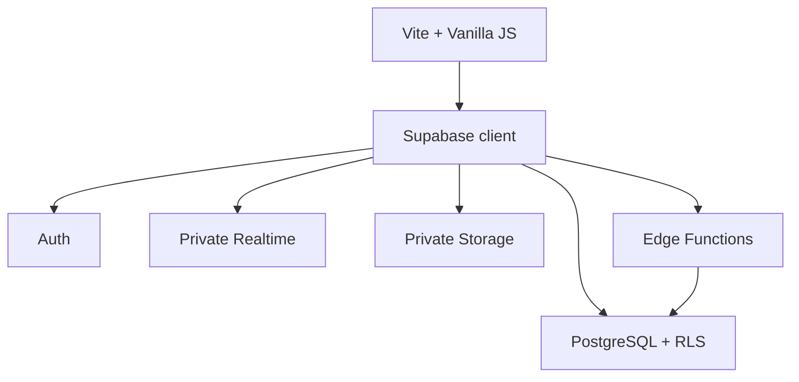

# TG Board architecture

## Decision

- Frontend: Vite + Vanilla JavaScript, introduced without a UI rewrite.
- Backend: Supabase Auth, PostgreSQL, Realtime and Storage.
- Authorization: PostgreSQL grants plus Row Level Security.
- Trusted mutations: PostgreSQL RPC functions; Edge Functions only when secrets or external rate limiting are required.
- Browser: untrusted. It receives no `service_role` key.

The current `localStorage` application remains untouched during the database foundation phase. A repository adapter will later allow the same UI to use either demo data or Supabase.

## Boundaries



## Target frontend layout

```text
src/
    core/
    data/
    features/
        auth/
        profile/
        forum/
        announcements/
        messages/
        notifications/
        moderation/
    lib/
    shared/
    styles/
supabase/
    migrations/
    functions/
    tests/
```
