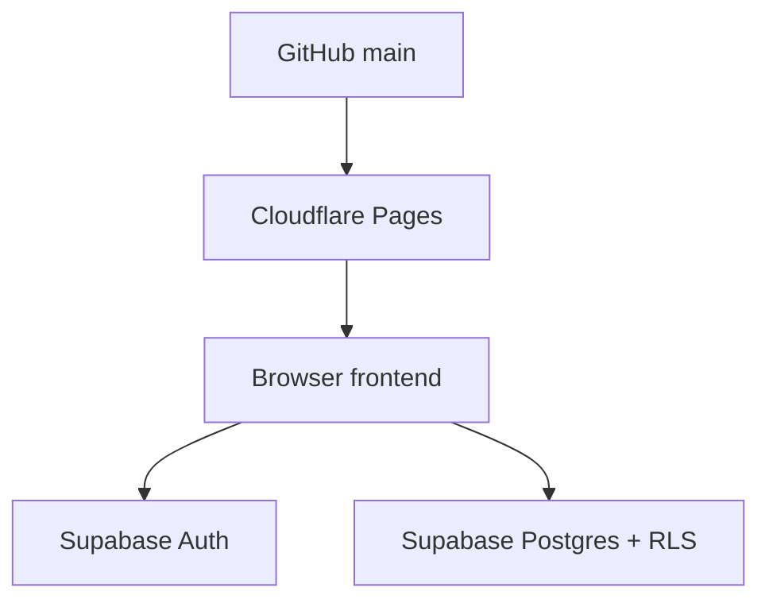

# AI Handoff — Rocco / Claude

This is the working contract for continuing TG Board without breaking the
backend/frontend boundary.

## What Bogdan + ChatGPT Changed

- Created the Supabase development project `TG Board`.
- Applied Backend V1 schema and RLS:
  - `profiles`
  - `profiles_public`
  - `threads`
  - `posts`
- Enabled email/password Auth with email confirmation.
- Added `js/supabase-config.js` with the public Supabase project URL and
  publishable browser key.
- Connected the existing `index.html` prototype to Supabase for Auth,
  profiles, threads, and posts.
- Published a temporary ChatGPT Sites preview.

## Architecture Going Forward

GitHub is the source of truth. Cloudflare Pages should be the public production
host. Supabase is the backend. ChatGPT Sites is only a temporary preview.

## Frontend Rules For Claude

Use the contract in `docs/BACKEND_BRIEF.md`.

Frontend should read/write:

- Own profile: `profiles`
- Public author display data: `profiles_public`
- Forum topics: `threads`
- Forum replies: `posts`

When creating threads or posts, do not send `author_id`. The database sets it
from `auth.uid()`.

Do not depend on nickname as identity. Use UUIDs.

## Files To Treat Carefully

- `supabase/migrations/20260903150000_core_foundation.sql`
- `docs/BACKEND_BRIEF.md`
- `js/supabase-config.js`
- `index.html`

If the frontend schema expectation changes, update `docs/BACKEND_BRIEF.md`
first so both AIs stay synchronized.

## What Is Not Backend V1 Yet

Do not build these as real Supabase features until their migrations exist:

- DMs
- Announcements
- Helpful/likes
- Moderation
- Notifications
- Uploads

They can stay as UI prototypes, but they should be visually marked or treated
as not-yet-production features.

## Cloudflare Pages Setup For Rocco

In Cloudflare Dashboard:

1. Go to Workers & Pages.
2. Create Pages project.
3. Connect GitHub.
4. Select `roccoschmitzkaatz-dotcom/tg-board-`.
5. Use:
   - Production branch: `main`
   - Framework preset: `None`
   - Build command: empty
   - Output directory: `/`
6. Deploy.
7. Send the production URL back to Bogdan.

After that, every merge into `main` should update the public site.
